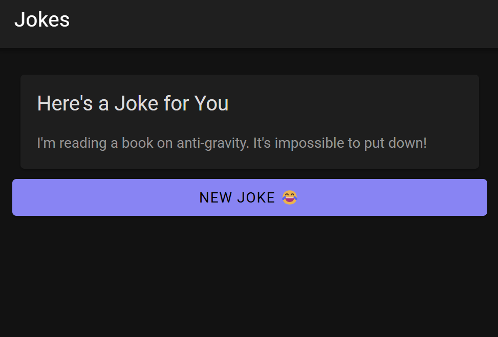
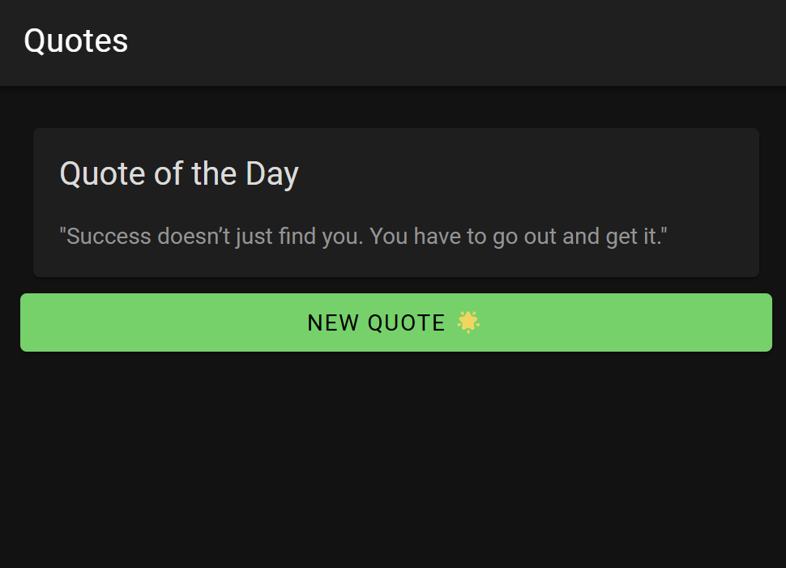
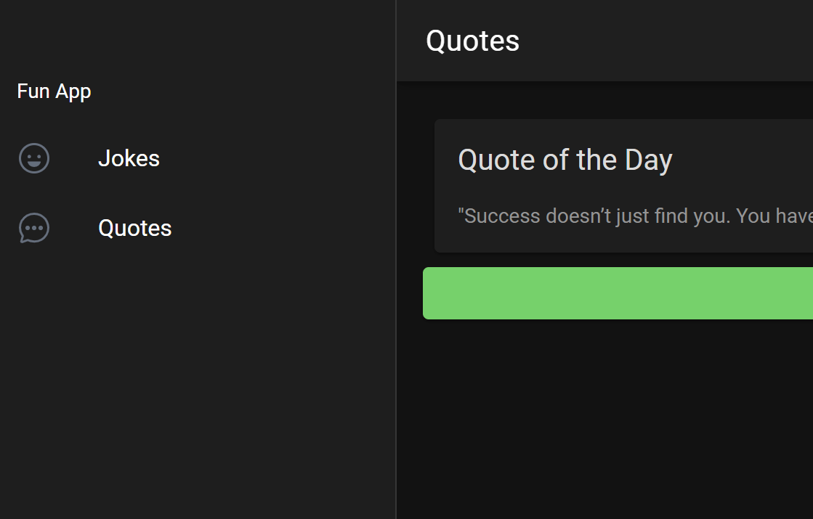

Jasmine Adzra
H1D022071
Prak Pemob shift D

Bagaimana cara untuk menambahkan Komponen di halaman Ionic? Jelaskan secara detail langkahnya.

1. Menambahkan Komponen Baru di Halaman Ionic
ionic generate page jokes
ionic generate page quotes

2. Menambahkan Komponen di Halaman (HTML)
   <ion-header>
  <ion-toolbar>
    <ion-title>Jokes</ion-title>
  </ion-toolbar>
</ion-header>

<ion-content>
  <ion-card>
    <ion-card-header>
      <ion-card-title>Joke of the Day</ion-card-title>
    </ion-card-header>
    <ion-card-content>
      
{{ joke }}

      <ion-button (click)="loadJoke()">Load New Joke</ion-button>
    </ion-card-content>
  </ion-card>
</ion-content>

3. Menambahkan Logika di TypeScript (TS)
   import { Component, OnInit } from '@angular/core';

@Component({
  selector: 'app-jokes',
  templateUrl: './jokes.page.html',
  styleUrls: ['./jokes.page.scss'],
})
export class JokesPage implements OnInit {
  joke: string = ''; // Inisialisasi string lelucon

  constructor() {}

  ngOnInit() {
    this.loadJoke(); // Memuat lelucon pertama saat halaman dimuat
  }

  loadJoke() {
    this.joke = "Why don’t scientists trust atoms? Because they make up everything!";
  }
}

4. Menambahkan Rute untuk Halaman
   import { NgModule } from '@angular/core';
import { PreloadAllModules, RouterModule, Routes } from '@angular/router';

const routes: Routes = [
  { path: '', redirectTo: 'jokes', pathMatch: 'full' },
  { path: 'jokes', loadChildren: () => import('./jokes/jokes.module').then(m => m.JokesPageModule) },
  { path: 'quotes', loadChildren: () => import('./quotes/quotes.module').then(m => m.QuotesPageModule) }
];

@NgModule({
  imports: [
    RouterModule.forRoot(routes, { preloadingStrategy: PreloadAllModules })
  ],
  exports: [RouterModule]
})
export class AppRoutingModule {}

5. Menghubungkan Halaman Melalui Menu
   <ion-app>
  <ion-split-pane contentId="main-content">
    <ion-menu contentId="main-content" type="overlay">
      <ion-content>
        <ion-list id="inbox-list">
          <ion-list-header>Menu</ion-list-header>
          <ion-note>simpleapp@example.com</ion-note>

          <ion-menu-toggle auto-hide="false">
            <ion-item routerDirection="root" routerLink="/jokes" lines="none" detail="false">
              <ion-icon aria-hidden="true" slot="start" name="happy-outline"></ion-icon>
              <ion-label>Jokes</ion-label>
            </ion-item>
            <ion-item routerDirection="root" routerLink="/quotes" lines="none" detail="false">
              <ion-icon aria-hidden="true" slot="start" name="quote"></ion-icon>
              <ion-label>Quotes</ion-label>
            </ion-item>
          </ion-menu-toggle>
        </ion-list>
      </ion-content>
    </ion-menu>
    <ion-router-outlet id="main-content"></ion-router-outlet>
  </ion-split-pane>
</ion-app>

6. Styling Halaman (CSS/SCSS)
   ion-card {
  background-color: #f4f4f8;
  color: #333;
  padding: 16px;
  text-align: center;
}

ion-button {
  --background: #3880ff;
  margin-top: 10px;
}

Penjelasan Program
Aplikasi ini terdiri dari dua halaman:

Jokes Page: Menampilkan lelucon yang dapat di-refresh dengan menekan tombol. Teks lelucon diinisialisasi di jokes.page.ts dan dimuat saat pengguna membuka halaman.
Quotes Page: Mirip dengan halaman Jokes, tetapi menampilkan kutipan inspiratif.
